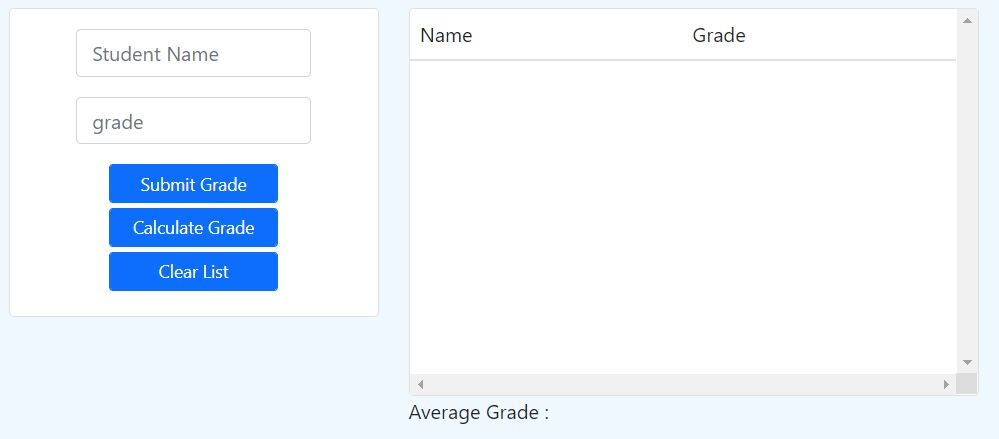
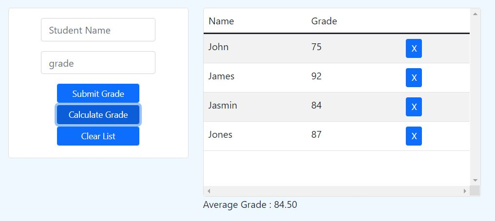

# Simple Grade Calculation Form

Steps:

1. Add Name and Grade
 - Submission will not proceed if there is no name and grade entered.
 - Submission will not proceed if grade is non numeric
 - Press Submit Grade to enter Name and Grade.

2. Calculate Grade
 - Press Calculate Grade to Calculate Entered Grade

3. Clear List
 - Press Clear List to delete all Data

Sample Submission and Calculation

Extra Additions:
Remove Button ( X button on every row)
- Remove Button will delete the specific data that needs to be remove.

- Validations upon submission of Grade with error message included
